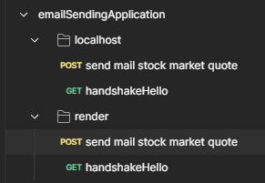

# Email sending application (Module #6, MERN Stack)



## Hosted Version of the Project:
[Email sending application](https://frontend-m6node-email-sending-application.vercel.app/)

## FrontEnd GitHub Repository Link
[FrontEnd Email sending application (Module #6, MERN Stack)](https://github.com/Alex21c/frontend-m6node-email-sending-application)

## Objectives
+ Created a Basic Form collecting Username and email, then will send stock market quote to the email address using using Nodemailer.
+ Learnt fundamentals of building a simple web form and using Nodemailer to send emails. 
+ Handling POST requests from the form
+ Parsing form data using body-parser or Express's built-in middleware.
+ Sending Emails with Nodemailer
+ Composing an email message from form data
+ Sending the email and handling success and error responses
+ Implementing basic form validation on the client side
+ Handling validation errors on the server side
+ Providing user feedback for successful and failed submissions

## How to install and run in yours local machine
```bash
npm install
npm run start
```

## .ENV file
```
GMAIL_USERNAME= NAME_YOU_WANT_TO_SHOW_WHEN_SENDING_EMAIL_USUALLY_ITS_FULL_NAME
GMAIL_EMAIL_ID= YOUR_GMAIL_EMAIL_ID
GMAIL_APP_PASSWORD= CREATE_YOUR_OWN_PASSWORD_FROM_APP_PASSWORD
```
[Gmail App Password Creation](https://myaccount.google.com/u/1/apppasswords)

## Postman API Endpoints file
[Postman API Endpoints.json](emailSendingApplication.postman_collection.json)


## API End Points : UrlShortener
### 1. Short URL
```
POST /api/v1/send-email/stock-market-quote
```
#### EXAMPLE REQUEST
```javascript
BODY x-www-form-urlencoded
 {
   firstName: Abhishek
   lastName: Kumar
   email: admin@alex21c.com
 }
```
#### RESPONSE
```javascript
{
    "success": true,
    "messageID": "<e553a7e4-2d26-026c-4706-a73741ead417@gmail.com>",
    "message": "Email sent !"
}
```

### 2. Perform handshake with the server, in case render has spun off the instance, it should re mount it
#### REQUEST
```
GET api/v1/send-email/handshake/hello
```

#### RESPONSE

```javascript
{
    "success": true,
    "message": "hi there!"
}
```

## Tech. Stack Used:
+ [MongoDB](https://www.mongodb.com/) 
+ [ExpressJS](https://expressjs.com/) 
+ [ReactJS](https://react.dev/) 
+ [NodeJS](https://nodejs.org/en/) 

## Author
[Abhishek kumar](https://www.linkedin.com/in/alex21c/), ([Geekster](https://geekster.in/) MERN Stack FS-14 Batch)


